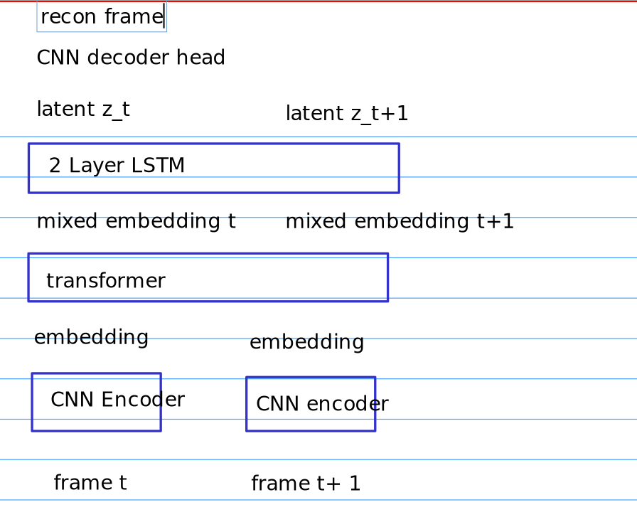

## Notes about masked autoencoding

- the main purpose of MAE is to pretrain a visual model that can be used for representation learning 

```python
        print("Pretrain agent.")
        for _ in range(config.mae_pretrain - config.pretrain):
            train_mae(next(mae_train_dataset))
        for _ in range(config.pretrain):
            train_mae(next(mae_train_dataset))
            train_agent(next(train_dataset))
           
```

- in MWM paper they pretrain the masked autoencoder 5000 epochs
- then during online RL learning, it will continue to learn mae for every 5 steps 

### input

the input is a sequence of images 

mae_dataset: {batch: 32, length: 32}


## Video Diffusion model 


## Architecture

- For the video auto-encoder we are going to use the following architecture 



then we can just simply change head to do other tasks. 

## RL environment notes

given $a_{t-1}, s_{t-1}$ we obtain $s_{t}$ and $r_t$

- state and reward at time $t$ are the immediate output by acting action $a_{t-1}$ at state $s_{t-1}$