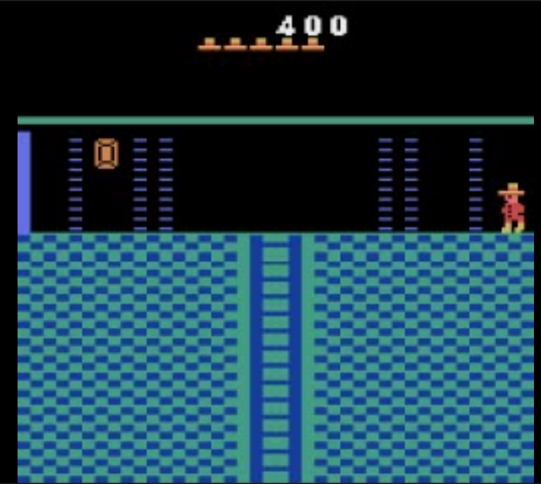
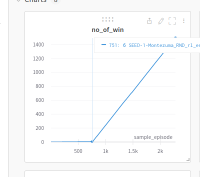
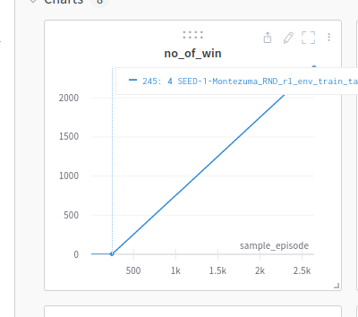
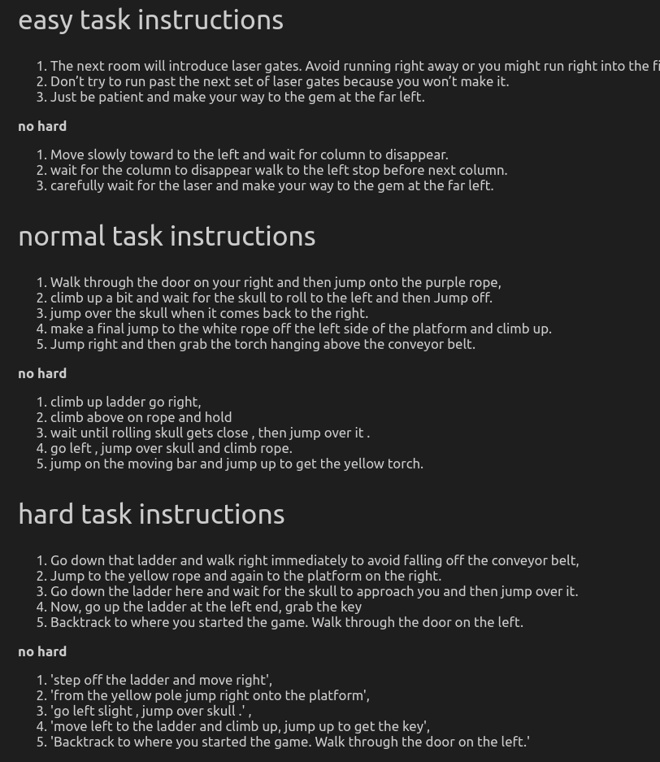
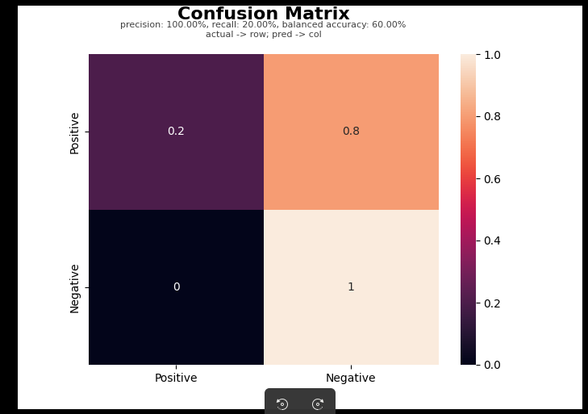

## Stage 1 feature

1. single image based visual autoencoder 
2. input of language reward module become {obs, action}
3. transformer based language reward module 


## Stage 2 feature 

1. Visual 
   1. video based visual autoencoder
   2. auto augmentation of the video image 
2. Action 
   1. predict action from video 
3. Language reward shaping module 
   1. Continue Transformer based 
   2. add hard negative data 
4. RL agent 
   1.  changed to RND algorithm 


## Stage 3 feature

Maybe stage 3 is about having better training data and validation data 

1. retrain the visual encoder with the annotated video

2. ~~maybe we remove the action detection first~~

4. ~~we will use the object detection annotated video as input~~

5. ~~can be solved by having more training data with vague to specific language descriptions~~

6. ~~can be solved by concatenating two or three pairs of data~~

7. ~~can be solved by balancing the phrase frequency~~

10. better validation set (validation for room one)

11. event detection version

    1. 300 frames

12. new language reward module output style and loss value 

    1. [start point, duration]
    2. loss = IoU loss + bounding loss 

    

    
    
    
    
    |                                                              | Goyal                                                        |                                                              |                                                              |                                                              |                                                              |                                                              |                                                              | Ours |
    | ------------------------------------------------------------ | ------------------------------------------------------------ | ------------------------------------------------------------ | ------------------------------------------------------------ | ------------------------------------------------------------ | ------------------------------------------------------------ | ------------------------------------------------------------ | ------------------------------------------------------------ | ---- |
    | ------------------------------------------------------       |                                                              |                                                              |                                                              |                                                              |                                                              |                                                              |                                                              |      |
    | add visual observations  address the object constraint in the language |                                                              | x                                                            | x                                                            | x                                                            | x                                                            | x                                                            | x                                                            |      |
    | visual encoder pretraining                                   |                                                              |                                                              | x                                                            | x                                                            | x                                                            | x                                                            | x                                                            |      |
    | object detection visual assistance  -> object constraints in language |                                                              |                                                              | x                                                            | x                                                            | x                                                            | x                                                            | x                                                            |      |
    | relative offsets to emphasize movement -> catch the movement information |                                                              |                                                              |                                                              | x                                                            | x                                                            | x                                                            | x                                                            |      |
    | hard negative description example -> corrupt noun phrases or verb phrases |                                                              |                                                              |                                                              |                                                              | x                                                            |                                                              | x                                                            |      |
    | -------------------------------------------------------      |                                                              |                                                              |                                                              |                                                              |                                                              |                                                              |                                                              |      |
    | event detection language reward module instead of binary classifier -> |                                                              |                                                              |                                                              |                                                              |                                                              | x                                                            | x                                                            |      |
    | --------------------------------------------------------     |                                                              |                                                              |                                                              |                                                              |                                                              |                                                              |                                                              |      |
    | remove action info from input and predict action from video ->    atari environment action may not function |                                                              |                                                              | x                                                            | x                                                            | x                                                            | x                                                            | x                                                            |      |
    | ---------------------------------------------------------    |                                                              |                                                              |                                                              |                                                              |                                                              |                                                              |                                                              |      |
    | random distillation RL method -> encourage exploration and avoid repeating actions | x                                                            |                                                              | x                                                            | x                                                            | x                                                            | x                                                            | x                                                            |      |
    | better immediate reward formula -> to avoid repeating actions to get more rewards | x                                                            |                                                              | x                                                            | x                                                            | x                                                            | x                                                            | x                                                            |      |
    |                                                              |                                                              |                                                              |                                                              |                                                              |                                                              |                                                              |                                                              |      |
    | -----------------------------------------------------------  |                                                              |                                                              |                                                              |                                                              |                                                              |                                                              |                                                              |      |
    | Note                                                         | The agent got stuck in local minimum and cannot escape from the first room, since the language reward shaping module is not accurate, the RL agent is able to easily find a way to cheat on the language reward score. | The model cannot handle the image input well well without visual pretraining. | The overall performance increases as we add pre-trained visual encoder and the object detection assistance, but still not high | By adding relative offset, the balanced accuracy increases, but the precision decreases, maybe it's because the relative offset cause the model to focus on the movement, and this increases the false positive. | Hard negatives examples generated by the phrase pollution method helps to increase the precision | the difference between event detection and binary cls is that in addition to predict relevancy, the model needs to also predict the correct occurrence time. This further trains the temporal understanding of the module | Add hard negatives to increase the precision                 |      |
    | -----------------------------------------------------------  |                                                              |                                                              |                                                              |                                                              |                                                              |                                                              |                                                              |      |
    | language reward module accuracy (IoU threshold > 0.2 for matched data) | precision: 37.50%, recall: 60.00%, balanced accuracy: 63.33% | Cannot converge                                              | TBA                                                          | precision: 50.00%, recall: 40.00%, balanced accuracy: 60.00% | precision: 40.00%, recall: 40.00%, balanced accuracy: 55.00% | precision: 50.00%, recall: 40.00%, balanced accuracy: 60.00% | precision: 66.67%, recall: 80.00%, balanced accuracy: 70.00% (simple instruction) |      |
    | Average no. of wins in 1000 training episodes (1 episode means the agent used up all its 4 life points) | 0                                                            |                                                              | 0                                                            | 0                                                            | 1 in 1000 training episode; 2 in 1200 training episode       | TBA                                                          | TBA                                                          |      |
    
    

 

Training data: the training data does not contain any room one demonstrations, Training data is from Goyal et. al. 2019 paper


Room one instruction. IMPORTANT: the instruction is from online game forum instead of creating by us. Link https://strategywiki.org/wiki/Montezuma%27s_Revenge/Walkthrough 

```
0	(x) Go down that ladder and walk right immediately to avoid falling off the conveyor belt, 
1	Jump to the yellow rope and again to the platform on the right.
2	(x) Go down the ladder here and wait for the skull to approach you and then jump over it.  
3	Now, go up the ladder at the left end, grab the key
4	Backtrack to where you started the game. Walk through the door on the left.
```

(x) means that the language reward shaping module cannot recognize the matched event (leading to false negative)


**Some points to characterize this work**

1. we proposed several methods to address the *state constraints*, *temporal constraints* and *action constraints* stated in the language instructions while the previous Goyal's work address these constraints. 
   1. To address state constraints: add state observations as input, add pretrained visual encoder and object detection assistance
   2. To address action constraints: use *relative offset*, predict action from video rather than directly use the game controller buttons data  
   3. To address temporal constraints: *event detection* instead of *binary classification*
2. we proposed some methods in the agent learning phase to stabilize the agent learning process
   1. use random distillation RL method to encourage exploration and avoid repeating actions
   2. $g_{i}^{t_n} = f(x_i)^{t_n} - \max(\{f(x_i)^\alpha | \alpha \in T\}) \text{ where }T=[t_0, t_1...t_{n-1}], i \text{ is sentence index}, t_n\text{ is the time step } n$ consider previous maximum score in the reward formula to avoid repeating actions & exploiting on the same language reward 
   3. $r_{i}^{t_n} = g_{i}^{t_n} + g_{i}^{t_n} \times \max(\{f(x_{i-1})^\alpha | \alpha \in T\})$ the language reward for the current sentence $i$ will be the output score of the language reward model $f$ times the score of the previous language reward. This encourage the agent to fulfill the instruction in the right sequential order. 
3. we found that we *high precision* is essential for the language reward shaping method. In other words, the false positive needs to be low, otherwise the learning agent may easily get distracted by the false positive rewards and it may focus on exploiting the false positive language rewards and cannot focus on the actual but sparse environmental reward anymore. 
   1. To solve these, we propose *phrase pollution method* to add hard negatives to improve the language reward shaping module's precision score. 


**Future work:** 

1. we see that there are two false negatives 

```
0	(x) Go down that ladder and walk right immediately to avoid falling off the conveyor belt, 
2	(x) Go down the ladder here and wait for the skull to approach you and then jump over it.  
```

2. the difficulty lies in the hypothetical thinking (e.g., avoid falling off) and conditional action (e.g., wait for the skull to approach you and then jump over it.)
3. In the future, explore the symbolic way to solve the two. 


```
Server

wandb: Run data is saved locally in /home/sukaih/Goyal_reward_shaping_stage_three/multirun/2022-12-13/17-46-06/0/wandb/run-20221213_174608-25z09wgg
wandb: Run `wandb offline` to turn off syncing.
wandb: Syncing run WithValidation-Updated_Lang_Rew_Event_Det_ver_has_obj_det-True_relative_offset-True_Dim-256_Action_pred-True_Neg_ratio-1.0

only one

wandb: Run data is saved locally in /home/sukaih/Goyal_reward_shaping_stage_three/multirun/2022-12-13/17-47-35/0/wandb/run-20221213_174737-385nldai
wandb: Run `wandb offline` to turn off syncing.
wandb: Syncing run WithValidation-Updated_Lang_Rew_Event_Det_ver_has_obj_det-True_relative_offset-True_Dim-256_Action_pred-True_Neg_ratio-0.7

only one

```

## TODOs

- [x] Try remove difficult part in the instruction.
- [ ] try worse RL algorithm 
- [ ] try different language model 
- [x] Try different room 

## Try different rooms 

**easy task**

grab the gem on the left 



**normal task**

grab the torch 


- The accuracy score does not increase for simpler tasks 
- the language reward shaping still slow down the learning speed of the agent finding the goal state 
  - With lang rew binary cls model (precision 33%, recall 80%)
  - 
  - Without lang rew
  - 


## Try simpler instructions 



- no significant improvements on the accuracy for easy and normal task 
- no significant improvement for hard task binary classification model
- some improvement for hard task event detection model 

## Use Event detection model 

- No significant improvement for easy and normal task -> recall score is very low 
- 
- Some improvement on hard task 

## Goyal's training data's quality is bad 

- Training accuracy is high, validation accuracy is high, but the testing accuracy (the testing data are created by me using online walkthrough instructions) is low. 


## Some Useful Info

1. manual https://atariage.com/manual_html_page.php?SoftwareLabelID=310 
2. the instruction is from online game forum instead of creating by us. Link https://strategywiki.org/wiki/Montezuma%27s_Revenge/Walkthrough 


## Future work 

1. remove background 
2. create within level negatives 
3. new project (positive paper)
   1. auto annotation 
      1. assume that some players grab the key / or escape the room, they must follow the instruction to some extent, thus we can have the fuzzy match of the human replay and the language instruction pair, and then we can use this as training data 
   2. **rebuttal** the way of calculating language reward -> current method: concatenation of atomic instructions which are manually separated. and use heuristic way to measure 
      1. the old way may lead to consistent false positive reward 
      2. the old way given Goyal's experiment, the compound of instructions leads to the product of success rate of each atomic instructions, and thereby causing the final success rate to drop dramatically. 
      3. the new way -> description generation based on the past trajectory (random sampling chunks with varying lengths) -> stop until the text generated is cosine similar to the first line of the walkthrough instruction. or if it reaches the maximum memory, we pop out the old memory -> now focus on the second line of the walkthrough instruction and clean the memory and restart text generation, use a new policy network and start the episode from the end of the first trajectory.
      4. no language reward here it is something like a guided exploration 
      5. in the end, there is no consistent false positive rewards, the exploration trajectory by the language instruction will be further used as the training replays for the learning agent. 
